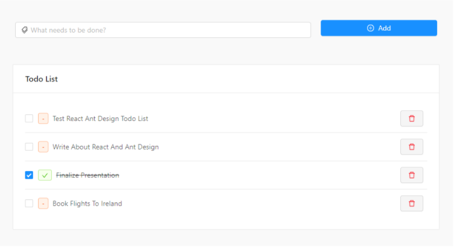

# [TODO List App](https://todo-list-kaif.netlify.app/)

This is Responsive TODO List App Assignment Created With Pure HTML/CSS & JS.

---

## Features

- Add new task
- Delete existing task
- Search for a specific task
- If task is not found while searching, show message no results found
- Mark task as done but checking the check box
- **Store details in local storage so if we refresh the page, data is fetched from the local storage instead of starting from scratch again.**

---

### App View

